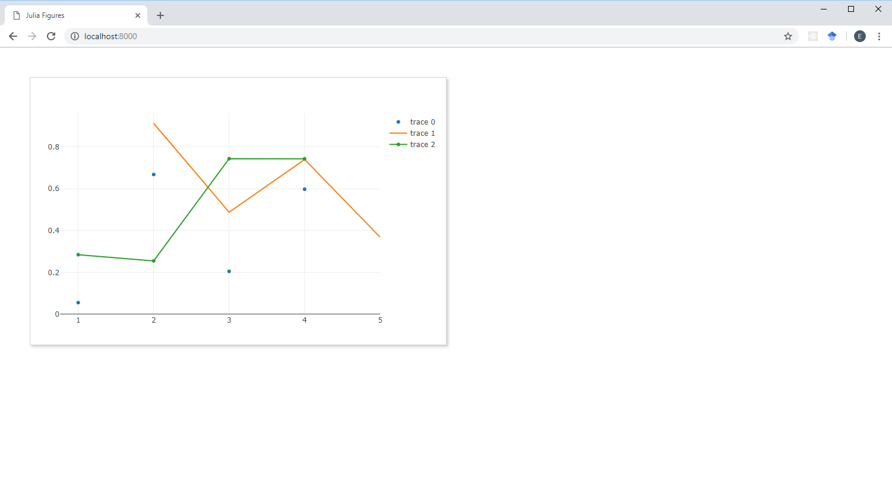
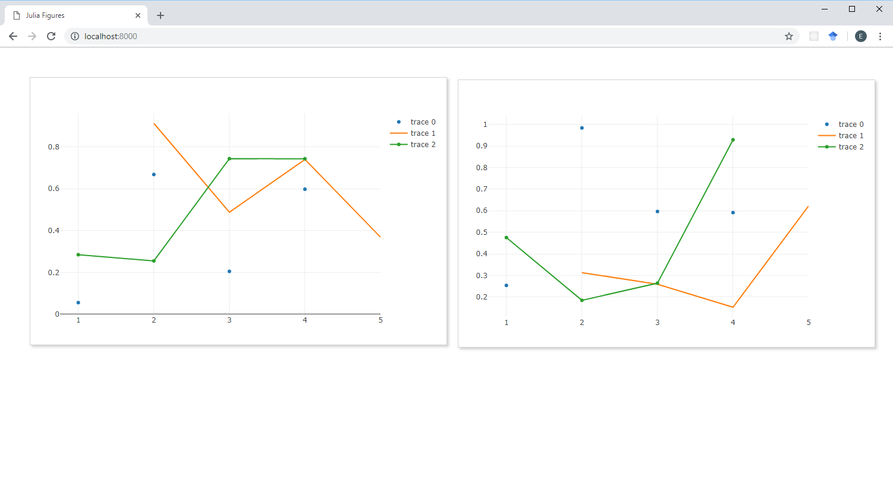
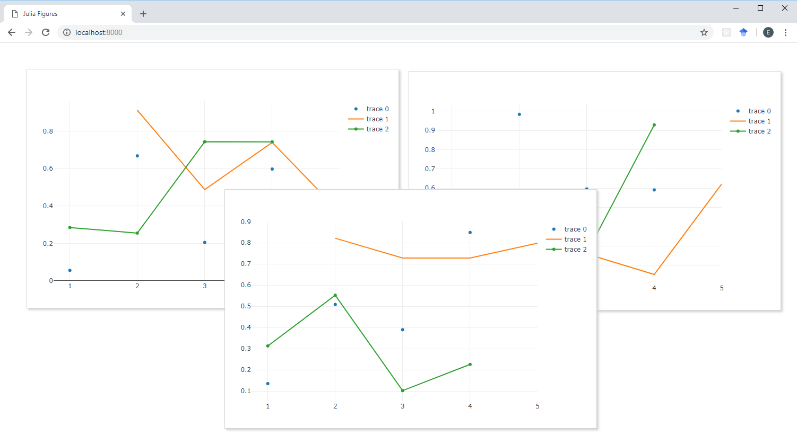

# Figures.jl

[![][travis-img]][travis-url] [![][appveyor-img]][appveyor-url]

`Figures.jl` is a simple package that creates draggable figures in a browser window to display plots from various plotting packages. It currently works with `PlotlyJS.jl`.

### Example

```julia
julia> using PlotlyJS, Figures
julia> Figures.start() # You can enter a port, e.g. Figures.start(3000). Default is 8000.
```

This launches a server on localhost. Opening the browser to `http://localhost:8000` will show a blank page.

Running

```julia
julia> figure(1)
```

displays a draggable figure in the browser.


Running

```julia
julia> function linescatter1()
    trace1 = PlotlyJS.scatter(;x = 1:4, y = rand(4), mode = "markers")
    trace2 = PlotlyJS.scatter(;x = 2:5, y = rand(4), mode = "lines")
    trace3 = PlotlyJS.scatter(;x = 1:4, y = rand(4), mode = "lines+markers")
    PlotlyJS.plot([trace1, trace2, trace3]) |> display
end
julia> linescatter1()
```

displays the interactive PlotlyJS chart in the figure.



A second figure can be created by running

```julia
julia> figure(2)
julia> linescatter1()
```



In addition to creating figures, the `figure` method can make an existing figure active again so that subsequent plots will be rendered on the active figure, e.g.

```julia
julia> figure(1)
julia> linescatter1()
```

will display a new chart on the existing figure.

You can add as many figures to the browser as you like



To remove figures, there is the method

```julia
julia> closeall()
```

which closes all figures and

```julia
julia> close(1)
```

which closes the specified figure.

Alternatively, figures can be closed directly in the browser by double clicking them.

### To Do

* Add support for `VegaLite.jl`
* Add support for `Plots.jl`
* Add support for resizing figures, etc.

[travis-img]: https://travis-ci.org/EricForgy/Figures.jl.svg?branch=master
[travis-url]: https://travis-ci.org/EricForgy/Figures.jl

[appveyor-img]: https://ci.appveyor.com/api/projects/status/github/EricForgy/Figures.jl?branch=master&svg=true
[appveyor-url]: https://ci.appveyor.com/project/EricForgy/figures-jl
